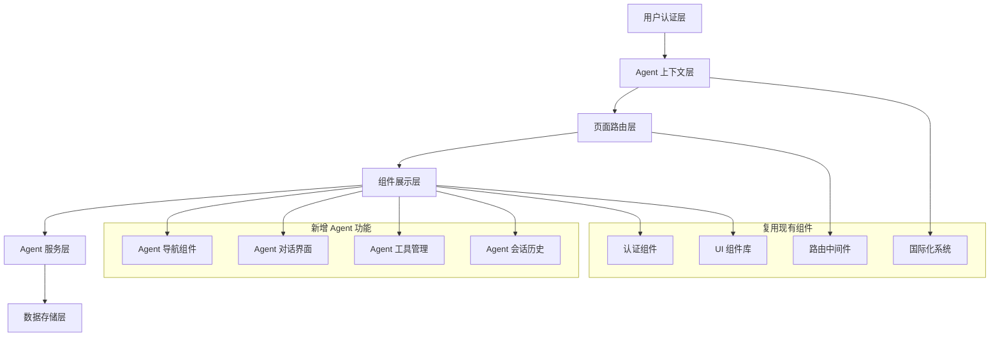

# Agent 系统整合技术设计文档

## 概述

本设计文档详细描述了如何将现有的认证演示系统转变为以 AI Agent 为核心的智能交互平台。设计重点关注代码复用、模块化架构、以及用户体验的连贯性，同时保持现有系统的稳定性和可扩展性。

## 引导文档对齐

### 技术标准 (tech.md)
本设计遵循项目的技术标准：
- **Next.js 15 + App Router**: 继续使用现有的路由架构
- **TypeScript**: 保持严格的类型安全
- **Supabase**: 扩展现有数据库架构而非重构
- **Tailwind CSS 4**: 使用一致的样式系统
- **国际化**: 扩展现有的 next-intl 配置

### 项目结构 (structure.md)
设计将遵循现有的项目组织约定：
- 组件按功能域分组 (`components/auth/`, `components/ai-agent/`, `components/ui/`)
- 清晰的导入/导出模式 (`index.ts` 文件)
- 服务层分离 (`lib/supabase/`, `lib/validations/`)

## 代码复用分析

### 现有组件的复用

- **认证系统**: 完全保留现有的认证流程和组件
  - `@/lib/supabase/auth-helpers`: 继续用于用户验证
  - `@/contexts/AuthContext`: 扩展以包含 Agent 用户偏好
  - `@/components/auth/*`: 保持不变

- **UI 组件库**: 最大化复用现有的 shadcn/ui 组件
  - `Button`, `Card`, `Input`, `Alert` 等基础组件
  - `Tabs`, `Dialog`, `Badge` 等复合组件
  - **现有 AI Elements**: 充分利用 `src/components/ai-elements/` 下的专业 AI 组件
    - `Conversation`, `Message`, `PromptInput` 等对话核心组件
    - `CodeBlock`, `Artifact`, `Tool` 等内容展示组件
    - `ChainOfThought`, `Reasoning` 等高级 AI 交互组件
    - `Loader`, `Suggestion`, `Actions` 等用户体验组件
  - 新增必要的 Agent 特定组件（基于现有 AI Elements 扩展）

- **国际化基础设施**: 扩展现有的 i18n 配置
  - `@/i18n/navigation`: 复用路由导航
  - `messages/zh.json`, `messages/en.json`: 添加 Agent 相关翻译

- **AI Agent 组件**: 扩展现有的 AI Agent 组件库
  - `ConversationInterface`: 增强对话功能
  - `AgentLayout`: 改进布局系统
  - `ToolExecutionVisualizer`: 优化工具可视化

### 集成点

- **用户数据系统**: 与现有的 Supabase 用户表集成
  - 使用现有的 `auth.users` 表作为主键外键
  - 扩展 `ai_agent_user_preferences` 表以支持新功能

- **路由系统**: 集成到现有的国际化路由中
  - 保持 `[locale]` 路由结构
  - 扩展中间件以处理 Agent 相关权限

- **样式系统**: 基于现有的 Tailwind 配置
  - 扩展设计令牌以支持极客风格
  - 保持响应式设计原则

## 架构

整体架构遵循现有的分层设计模式，通过扩展而非重构来实现 Agent 功能的集成。

### 模块化设计原则

- **单文件职责**: 每个文件专注于单一关注点或领域
- **组件隔离**: 创建小型、专注的组件而非大型单体文件
- **服务层分离**: 分离数据访问、业务逻辑和展示层
- **工具模块化**: 将工具拆分为专注的单一目的模块



## 组件和接口

### 1. Agent 导航组件 (AgentNavigation)
- **目的**: 替换现有导航，突出 Agent 功能
- **接口**:
  - `currentPage: string`
  - `userMode: 'simple' | 'advanced'`
  - `onNavigate: (path: string) => void`
- **依赖**: `@/contexts/AuthContext`, `@/i18n/navigation`
- **复用**: 现有的 `Navbar` 组件架构和样式模式

### 2. Agent 欢迎页面 (AgentWelcomePage)
- **目的**: 替换现有首页，作为 Agent 功能门户
- **接口**:
  - `user: User | null`
  - `locale: string`
  - `onStartConversation: () => void`
- **依赖**: `@/components/ui/*`, `@/components/ai-elements/*`, Agent 相关组件
- **复用**: 现有页面布局模式和响应式设计
- **AI Elements**: 使用现有的 `Suggestion` 和 `Actions` 组件提供友好的对话引导

### 3. Agent 仪表板 (AgentDashboard)
- **目的**: 转换现有 Dashboard 为 Agent 活动中心
- **接口**:
  - `sessionsSummary: SessionSummary[]`
  - `recentActivity: ActivityItem[]`
  - `userStats: UserStats`
- **依赖**: Agent 数据服务，UI 组件，`@/components/ai-elements/*`
- **复用**: 现有的 Dashboard 布局和卡片组件
- **AI Elements**: 使用现有的 `Message` 和 `Conversation` 组件展示对话历史预览

### 4. Agent 用户偏好 (AgentUserPreferences)
- **目的**: 扩展个人资料页面，包含 Agent 设置
- **接口**:
  - `preferences: AgentPreferences`
  - `onSave: (preferences: AgentPreferences) => Promise<void>`
- **依赖**: Supabase 客户端，表单验证
- **复用**: 现有的表单组件和验证模式

### 5. Agent 会话管理器 (AgentSessionManager)
- **目的**: 管理 Agent 会话状态和持久化
- **接口**:
  - `createSession: (config: SessionConfig) => Promise<Session>`
  - `loadSession: (sessionId: string) => Promise<Session>`
  - `saveSession: (session: Session) => Promise<void>`
- **依赖**: Supabase 客户端，Agent 数据模型
- **复用**: 现有的数据库助手模式

### 6. Agent 响应式布局 (AgentResponsiveLayout)
- **目的**: 为所有 Agent 页面提供一致的响应式布局
- **接口**:
  - `children: ReactNode`
  - `sidebar?: ReactNode`
  - `header?: ReactNode`
- **依赖**: CSS Grid, Tailwind 响应式类
- **复用**: 现有的布局模式和断点配置

## 数据模型

### 扩展用户偏好模型
```typescript
interface AgentUserPreferences {
  user_id: string
  default_mode: 'simple' | 'advanced'
  theme: 'light' | 'dark' | 'system'
  language: 'zh' | 'en'

  // Agent 特定偏好
  default_model: string
  temperature: number
  max_tokens: number
  auto_save: boolean
  show_token_usage: boolean
  enable_notifications: boolean

  // 隐私设置
  data_retention_days: number
  share_analytics: boolean

  // 个性化配置
  custom_prompts: CustomPrompt[]
  quick_actions: QuickAction[]

  created_at: Date
  updated_at: Date
}
```

### Agent 会话摘要模型
```typescript
interface SessionSummary {
  id: string
  title: string
  message_count: number
  last_activity: Date
  mode: 'simple' | 'advanced'
  tags: string[]
  preview_text: string
}
```

### Agent 导航配置模型
```typescript
interface NavigationConfig {
  primary_items: NavigationItem[]
  user_mode: 'simple' | 'advanced'
  show_advanced_features: boolean
}

interface NavigationItem {
  key: string
  label_key: string // 国际化键
  icon: LucideIcon
  path: string
  requires_auth: boolean
  show_in_mode: ('simple' | 'advanced')[]
}
```

## 错误处理

### 错误场景

1. **Agent 服务不可用**
   - **处理**: 显示降级的静态界面，保留基本导航功能
   - **用户影响**: 用户看到"Agent 功能暂时不可用"消息，但仍可使用认证功能

2. **会话数据加载失败**
   - **处理**: 提供重试机制，失败后提供创建新会话选项
   - **用户影响**: 临时失去历史对话，但可以开始新对话

3. **用户偏好同步失败**
   - **处理**: 使用本地存储作为备份，后台重试同步
   - **用户影响**: 设置变更可能延迟生效，显示同步状态指示

4. **国际化文件加载失败**
   - **处理**: 回退到默认语言（中文），显示加载错误
   - **用户影响**: 界面显示默认语言，功能正常使用

5. **导航状态混乱**
   - **处理**: 重置到默认的首页状态，清理无效的路由参数
   - **用户影响**: 用户被重定向到安全的默认页面

## 测试策略

### 单元测试
- **Agent 组件测试**: 使用 Jest + React Testing Library
  - `AgentNavigation` 组件的状态管理
  - `AgentUserPreferences` 的表单验证
  - `AgentSessionManager` 的数据操作
- **工具函数测试**:
  - 国际化辅助函数
  - Agent 配置解析器
  - 响应式布局计算

### 集成测试
- **认证流程集成**: 验证 Agent 功能与现有认证的集成
- **数据库集成**: 测试 Agent 数据与用户数据的关联
- **国际化集成**: 验证多语言切换在 Agent 界面中的表现
- **路由集成**: 测试 Agent 页面的导航和权限控制

### 端到端测试 (E2E)
- **用户注册到 Agent 使用流程**:
  - 注册 → 登录 → 进入 Agent → 开始对话
- **Agent 功能完整流程**:
  - 创建会话 → 发送消息 → 使用工具 → 查看历史
- **多设备响应式测试**:
  - 桌面端完整功能验证
  - 移动端简化界面验证
  - 平板端中等复杂度验证
- **多语言切换测试**:
  - 中英文界面切换
  - Agent 对话多语言支持
  - 历史记录语言保持

### 性能测试
- **加载性能**: 首页加载时间 < 2s，Agent 界面初始化 < 3s
- **响应性能**: 导航切换 < 500ms，对话响应 < 3s
- **内存测试**: 长时间会话内存使用稳定性
- **并发测试**: 多用户同时使用 Agent 功能的稳定性

## 技术实施细节

### 渐进式迁移策略
1. **阶段 0**: 分析和优化现有 AI Elements 组件的使用
2. **阶段 1**: 创建新的 Agent 导航和首页，保持现有功能不变
3. **阶段 2**: 增强现有的 Agent 组件，集成现有 AI Elements 的完整功能
4. **阶段 3**: 重构 Dashboard 和个人资料页面，集成 Agent 功能
5. **阶段 4**: 优化性能和用户体验，添加高级 AI 交互功能

### 现有 AI Elements 优化策略
- **核心组件集成**: 充分利用现有的 `Conversation`, `Message`, `PromptInput` 等组件
- **流式响应支持**: 利用现有组件的流式消息传输能力
- **多模态内容**: 使用 `Image`, `CodeBlock`, `Artifact` 等组件支持多种内容类型
- **高级交互**: 集成 `ChainOfThought`, `Reasoning`, `Tool` 等高级 AI 功能组件
- **用户体验**: 使用 `Loader`, `Suggestion`, `Actions` 等提升交互体验
- **自定义主题**: 配置现有 AI Elements 以匹配应用的极客风设计

### 数据迁移计划
- 现有用户自动获得默认的 Agent 偏好设置
- 现有的用户认证和会话保持完全兼容
- 新的 Agent 数据表通过外键关联现有用户表

### 部署和回滚策略
- 使用功能开关控制新界面的启用
- 保留现有页面作为回滚选项
- 数据库迁移使用可逆的 Supabase 迁移脚本