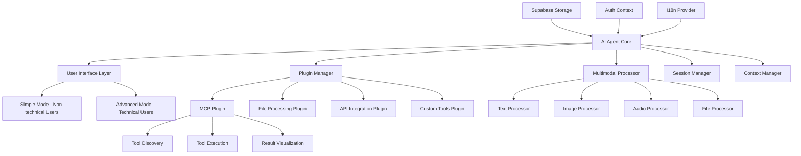

# Design Document

## Overview

AI Agent 是一个集成到 Mango 认证系统中的通用智能代理平台，为非技术用户和技术用户提供易用且强大的 AI 工具交互环境。该平台支持多模态输入输出、可扩展的工具集成架构，其中 Model Context Protocol (MCP) 功能作为一个可配置模块提供高级工具管理能力。

该设计采用插件化架构，允许用户根据需求配置不同的功能模块，包括对话式 AI 交互、工具调用可视化、多模态内容处理等，确保既满足非技术用户的直观操作需求，也为技术用户提供深度定制能力。

## Steering Document Alignment

### Technical Standards (tech.md)
由于项目中暂无 tech.md 文档，本设计将遵循从代码库中观察到的技术模式：
- 使用 TypeScript 进行类型安全开发
- 采用 Next.js 15 App Router 架构
- 遵循 React 19 最佳实践
- 使用 Tailwind CSS 进行样式设计
- 集成 Supabase 进行数据持久化
- 支持 next-intl 国际化框架

### Recommended Library Integration
根据审批反馈和最佳实践研究，本设计将集成以下推荐库：

- **@modelcontextprotocol/sdk**: 官方 MCP SDK，提供标准化的 MCP 客户端实现
  - 支持 Streamable HTTP 和 SSE 传输协议
  - 内置会话管理和重连机制
  - TypeScript 类型安全的工具调用
  - 支持多种传输方式：WebSocket、HTTP、stdio

- **Vercel AI SDK**: 增强 AI 功能集成，支持智能工具推荐和自动化测试
  - `useChat` Hook 用于对话式交互
  - 流式响应和实时工具调用
  - 多模态内容处理支持
  - 工具调用状态管理和可视化

- **Vercel AI Elements**: 提供预构建的 AI 交互组件，优化用户体验
  - `Conversation` 和 `Message` 组件用于对话界面
  - `Response` 组件用于 AI 响应渲染
  - `CodeBlock` 组件用于代码显示
  - 基于 shadcn/ui 的可定制设计

### Advanced Technology Integration
基于最佳实践研究的技术选型：

```typescript
// MCP 客户端最佳实践配置
interface MCPClientConfig {
  // 使用 TypeScript SDK 推荐的配置
  transport: 'streamable-http' | 'sse' | 'websocket'

  // 会话管理（基于 MCP SDK 示例）
  sessionManagement: {
    sessionIdGenerator: () => string
    sessionStorage: 'memory' | 'database'
    reconnectionStrategy: 'exponential-backoff'
    maxRetries: 3
  }

  // 兼容性支持
  backwardsCompatibility: {
    sseSupport: boolean      // 支持旧版 SSE 协议
    protocolNegotiation: boolean
  }

  // 安全配置
  security: {
    corsEnabled: boolean
    allowedOrigins: string[]
    dnsRebindingProtection: boolean
  }
}

// Vercel AI SDK 集成配置
interface AISDKIntegration {
  // 使用 useChat Hook 管理对话
  chatConfig: {
    api: '/api/chat'
    transport: 'DefaultChatTransport'
    sendAutomaticallyWhen: 'lastAssistantMessageIsCompleteWithToolCalls'
  }

  // 工具调用处理
  toolHandling: {
    clientSideTools: string[]        // 自动执行的客户端工具
    serverSideTools: string[]        // 需要服务器处理的工具
    userInteractionTools: string[]   // 需要用户交互的工具
  }

  // AI Elements 组件配置
  components: {
    conversation: 'ai-elements/conversation'
    message: 'ai-elements/message'
    response: 'ai-elements/response'
    codeBlock: 'ai-elements/code-block'
  }
}
```

### Project Structure (structure.md)
遵循现有项目组织约定：
- 页面组件放置在 `src/app/[locale]/` 目录
- 可复用组件放置在 `src/components/` 目录
- 业务逻辑和服务放置在 `src/lib/` 目录
- TypeScript 类型定义放置在 `src/types/` 目录
- 国际化配置和翻译文件遵循现有 i18n 结构

## Code Reuse Analysis

### Existing Components to Leverage
- **AuthContext**: 用于获取当前用户认证状态，确保只有认证用户可以访问 MCP 工具管理功能
- **Button/Input/Card UI组件**: 复用现有 shadcn/ui 组件库构建一致的用户界面
- **LanguageSwitcher**: 集成现有语言切换功能，支持中英文界面
- **Navbar**: 扩展现有导航栏，添加 MCP 工具管理的导航入口
- **I18nErrorBoundary**: 复用现有错误边界组件处理 MCP 相关的国际化错误

### Integration Points
- **Supabase 认证系统**: 利用现有认证中间件和用户会话管理
- **数据库**: 在 Supabase 中新增表来存储 MCP 工具配置和调用历史
- **国际化系统**: 扩展现有 messages/zh.json 和 messages/en.json 翻译文件
- **路由保护**: 集成现有中间件，将 MCP 工具页面加入受保护路由列表
- **表单验证**: 复用现有 Zod 验证模式进行 MCP 工具配置验证

## Architecture

该功能采用模块化插件架构设计，遵循单一职责原则和可扩展性理念：

### Core Architecture Principles
- **Plugin-Based Design**: 核心 Agent 引擎 + 可插拔功能模块（MCP、多模态处理、工具调用等）
- **Dual User Experience**: 为非技术用户提供简化界面，为技术用户提供高级配置
- **Multimodal Support**: 统一处理文本、图像、音频、文件等多种输入输出
- **Progressive Disclosure**: 根据用户技能水平渐进式展示功能复杂度
- **Real-time Interaction**: 支持流式响应和实时工具调用状态展示



## Components and Interfaces

### AI Agent Core Engine
- **Purpose:** 核心智能代理引擎，管理会话、上下文和插件协调
- **Interfaces:**
  - `startConversation(options: ConversationOptions): Promise<ConversationSession>`
  - `processInput(input: MultimodalInput): Promise<AgentResponse>`
  - `executeTools(toolCalls: ToolCall[]): Promise<ToolResult[]>`
  - `manageContext(action: ContextAction): Promise<void>`
  - `loadPlugin(plugin: AgentPlugin): Promise<void>`
- **Dependencies:** Vercel AI SDK, Context Manager, Plugin Manager
- **Reuses:** 现有认证系统、错误处理模式

### User Interface Layer
- **Purpose:** 提供适应不同用户技能水平的交互界面
- **Interfaces:**
  - `switchMode(mode: 'simple' | 'advanced'): void`
  - `renderInput(type: InputType, constraints?: InputConstraints): ReactNode`
  - `renderOutput(content: MultimodalContent): ReactNode`
  - `showToolExecution(execution: ToolExecution): void`
- **Dependencies:** Vercel AI Elements, UI 组件库, 多模态处理器
- **Reuses:** 现有 shadcn/ui 组件、国际化系统

### Multimodal Processor
- **Purpose:** 统一处理多种类型的输入输出内容，提供友好的查看编辑界面
- **Interfaces:**
  - `processInput(input: File | Text | Image | Audio): Promise<ProcessedInput>`
  - `renderContent(content: MultimodalContent, mode: ViewMode): ReactNode`
  - `enableEditing(content: EditableContent): EditableComponent`
  - `extractMetadata(content: any): ContentMetadata`
  - `validateFormat(content: any, expectedType: ContentType): ValidationResult`
- **Dependencies:** 文件处理库、图像处理库、音频处理库
- **Reuses:** 现有文件上传组件、错误处理模式

#### Supported Content Types and Interfaces
```typescript
// 文本内容 - 支持 Markdown、代码、JSON 等，集成专业代码编辑器
interface TextContent {
  type: 'text'
  format: 'plain' | 'markdown' | 'code' | 'json' | 'xml' | 'yaml' | 'sql'
  content: string
  language?: string // for code syntax highlighting
  editable: boolean
  metadata?: {
    encoding?: string
    lineCount?: number
    fileSize?: number
  }
}

// 代码内容 - 使用专业代码编辑器组件（Monaco Editor 或 CodeMirror）
interface CodeContent {
  type: 'code'
  language: 'javascript' | 'typescript' | 'python' | 'java' | 'go' | 'rust' | 'html' | 'css' | 'sql' | 'json' | 'yaml' | 'markdown'
  content: string
  editable: boolean
  features: {
    syntaxHighlighting: boolean
    lineNumbers: boolean
    autoCompletion: boolean
    errorLinting: boolean
    formatOnSave: boolean
    minimap: boolean
  }
  theme: 'vs-dark' | 'vs-light' | 'high-contrast'
}

// HTML 内容 - 提供代码编辑和实时预览功能
interface HTMLContent {
  type: 'html'
  content: string
  editable: boolean
  preview: {
    enabled: boolean
    sandboxed: boolean
    responsive: boolean
    devicePresets: ('mobile' | 'tablet' | 'desktop')[]
  }
  dependencies?: {
    css?: string[]
    js?: string[]
  }
}

// 图像内容 - 支持查看、注释、基础编辑
interface ImageContent {
  type: 'image'
  format: 'png' | 'jpg' | 'svg' | 'gif' | 'webp'
  url: string
  metadata?: ImageMetadata
  annotations?: Annotation[]
  editable: boolean
  tools: {
    zoom: boolean
    rotate: boolean
    crop: boolean
    filters: boolean
  }
}

// 音频内容 - 支持播放、波形显示、转录
interface AudioContent {
  type: 'audio'
  format: 'mp3' | 'wav' | 'ogg' | 'aac'
  url: string
  duration: number
  transcript?: string
  waveform?: number[]
  controls: {
    playback: boolean
    scrubbing: boolean
    speedControl: boolean
    volumeControl: boolean
  }
}

// 文件内容 - 支持预览、下载、元数据显示
interface FileContent {
  type: 'file'
  name: string
  size: number
  mimeType: string
  url: string
  preview?: PreviewData
  metadata?: FileMetadata
  actions: {
    download: boolean
    share: boolean
    edit: boolean
    delete: boolean
  }
}

// 数据表格内容 - 支持结构化数据显示和编辑
interface DataTableContent {
  type: 'data-table'
  format: 'csv' | 'json' | 'xml' | 'excel'
  headers: string[]
  rows: any[][]
  editable: boolean
  features: {
    sorting: boolean
    filtering: boolean
    pagination: boolean
    export: boolean
    columnResize: boolean
  }
}
```

### Advanced Code Editor Integration
基于研究的最佳实践，代码编辑器组件设计：

```typescript
interface CodeEditorComponent {
  // 基于 Monaco Editor 或 CodeMirror 的专业代码编辑器
  editor: 'monaco' | 'codemirror'

  // 支持的编程语言和配置
  languages: {
    typescript: MonacoTypeScriptConfig
    javascript: MonacoJavaScriptConfig
    python: CodeMirrorPythonConfig
    html: HTMLPreviewConfig
    css: CSSPreviewConfig
    json: JSONSchemaConfig
  }

  // AI 增强功能
  aiFeatures: {
    codeCompletion: boolean      // AI 代码补全
    errorExplanation: boolean    // AI 错误解释
    codeOptimization: boolean    // AI 代码优化建议
    documentGeneration: boolean  // AI 文档生成
  }

  // 主题和外观
  themes: {
    dark: 'vs-dark' | 'monokai' | 'github-dark'
    light: 'vs-light' | 'github-light' | 'solarized-light'
    highContrast: 'hc-black' | 'hc-light'
  }

  // 编辑器功能
  features: {
    lineNumbers: boolean
    minimap: boolean
    wordWrap: boolean
    autoIndent: boolean
    bracketMatching: boolean
    folding: boolean
    find: boolean
    replace: boolean
    multiCursor: boolean
  }
}

// HTML 实时预览配置
interface HTMLPreviewConfig {
  mode: 'split' | 'tabs' | 'overlay'

  // 预览窗口配置
  preview: {
    sandboxed: boolean           // 安全沙箱
    responsive: boolean          // 响应式预览
    reloadOnChange: boolean     // 自动重载
    errorOverlay: boolean       // 错误覆盖显示
  }

  // 设备模拟
  devices: {
    mobile: { width: 375, height: 812 }
    tablet: { width: 768, height: 1024 }
    desktop: { width: 1440, height: 900 }
  }

  // 外部依赖注入
  dependencies: {
    css: string[]               // CSS 框架链接
    js: string[]                // JavaScript 库链接
  }
}
```

### Tool Execution Visualizer
- **Purpose:** 提供友好的工具调用和分步处理显示，详略得当地展示执行过程
- **Interfaces:**
  - `visualizeExecution(execution: ToolExecution): ReactNode`
  - `showStep(step: ExecutionStep, detail: DetailLevel): ReactNode`
  - `renderProgress(progress: ExecutionProgress): ReactNode`
  - `displayResult(result: ToolResult, format: ResultFormat): ReactNode`
  - `handleError(error: ExecutionError): ReactNode`
- **Dependencies:** UI 组件库、动画库、图表库
- **Reuses:** 现有 Progress、Alert、Card 组件

#### Tool Execution Display Patterns
```typescript
// 执行步骤接口 - 支持分层显示
interface ExecutionStep {
  id: string
  name: string
  status: 'pending' | 'running' | 'completed' | 'failed'
  startTime: Date
  endTime?: Date
  input?: any
  output?: any
  error?: string
  subSteps?: ExecutionStep[] // 支持嵌套步骤
  metadata: {
    tool: string
    function: string
    estimatedDuration?: number
    complexity: 'low' | 'medium' | 'high'
  }
}

// 显示级别配置
interface DetailLevel {
  overview: boolean      // 总体进度
  stepDetails: boolean   // 步骤详情
  parameters: boolean    // 参数显示
  timing: boolean        // 执行时间
  intermediate: boolean  // 中间结果
  technical: boolean     // 技术细节
}

// 用户模式预设
const DisplayPresets = {
  simple: {
    overview: true,
    stepDetails: false,
    parameters: false,
    timing: false,
    intermediate: false,
    technical: false
  },
  detailed: {
    overview: true,
    stepDetails: true,
    parameters: true,
    timing: true,
    intermediate: true,
    technical: false
  },
  technical: {
    overview: true,
    stepDetails: true,
    parameters: true,
    timing: true,
    intermediate: true,
    technical: true
  }
}
```

### Plugin Manager
- **Purpose:** 管理可插拔功能模块，包括 MCP 插件的配置和运行
- **Interfaces:**
  - `loadPlugin(plugin: AgentPlugin): Promise<void>`
  - `unloadPlugin(pluginId: string): Promise<void>`
  - `configurePlugin(pluginId: string, config: PluginConfig): Promise<void>`
  - `listAvailablePlugins(): Promise<PluginInfo[]>`
  - `getPluginStatus(pluginId: string): PluginStatus`
- **Dependencies:** Plugin API, 配置管理器
- **Reuses:** 现有的模块加载模式、错误处理

#### MCP Plugin Specification
```typescript
interface MCPPlugin extends AgentPlugin {
  type: 'mcp'
  mcpConfig: {
    serverUrl: string
    protocol: 'websocket' | 'http' | 'stdio'
    authentication?: AuthConfig
    capabilities: string[]
  }
  tools: MCPToolDefinition[]
  ui: {
    simpleMode: boolean    // 是否支持简化模式
    configurable: boolean  // 是否允许用户配置
    autoDiscovery: boolean // 是否支持自动发现
  }
}
```

## Data Models

### Agent Session
```typescript
interface AgentSession {
  id: string
  userId: string
  name?: string
  type: 'conversation' | 'task' | 'analysis'
  context: ConversationContext
  plugins: string[] // 已加载的插件ID
  preferences: UserPreferences
  createdAt: Date
  lastActivity: Date
  isActive: boolean
}

interface ConversationContext {
  messages: Message[]
  tools: ToolDefinition[]
  files: AttachedFile[]
  variables: Record<string, any>
  memory: ConversationMemory
}
```

### Multi-Modal Message
```typescript
interface Message {
  id: string
  role: 'user' | 'agent' | 'system'
  content: MultimodalContent[]
  timestamp: Date
  toolCalls?: ToolCall[]
  metadata?: MessageMetadata
}

interface MultimodalContent {
  type: 'text' | 'image' | 'audio' | 'file' | 'code' | 'data'
  data: TextContent | ImageContent | AudioContent | FileContent
  display: {
    primary: boolean    // 主要内容
    collapsible: boolean // 可折叠
    editable: boolean   // 可编辑
  }
}
```

### Plugin System Models
```typescript
interface AgentPlugin {
  id: string
  name: string
  version: string
  type: 'mcp' | 'api' | 'file' | 'custom'
  description: string
  author: string
  config: PluginConfig
  capabilities: Capability[]
  ui: UIConfiguration
  dependencies?: string[]
}

interface PluginConfig {
  enabled: boolean
  settings: Record<string, any>
  permissions: Permission[]
  userConfigurable: string[] // 用户可配置的设置键
}
```

### Tool Execution Models
```typescript
interface ToolExecution {
  id: string
  sessionId: string
  toolId: string
  function: string
  parameters: any
  status: ExecutionStatus
  steps: ExecutionStep[]
  result?: ToolResult
  error?: ExecutionError
  startTime: Date
  endTime?: Date
  duration?: number
}

interface ToolResult {
  success: boolean
  data: any
  format: 'text' | 'json' | 'html' | 'image' | 'file'
  metadata: {
    size?: number
    mimeType?: string
    encoding?: string
  }
  display: ResultDisplayOptions
}
```

## Error Handling

### Error Scenarios
1. **插件加载失败:**
   - **Handling:** 显示友好错误信息，提供重试选项，回退到核心功能
   - **User Impact:** 非技术用户看到简化错误提示，技术用户获得详细调试信息

2. **多模态内容处理错误:**
   - **Handling:** 根据内容类型提供降级处理，保留原始文件，显示处理失败原因
   - **User Impact:** 内容仍可访问，提供替代查看方式

3. **工具执行超时或失败:**
   - **Handling:** 实时显示执行状态，允许取消操作，记录详细错误日志
   - **User Impact:** 清晰的进度指示，可控的执行流程

4. **权限和认证错误:**
   - **Handling:** 检查用户权限，引导重新认证，临时保存工作状态
   - **User Impact:** 无缝的认证流程，不丢失工作进度

5. **网络连接和数据同步问题:**
   - **Handling:** 离线模式支持，自动重试机制，本地数据缓存
   - **User Impact:** 基本功能离线可用，恢复连接后自动同步

### User Experience Error Patterns
```typescript
interface ErrorDisplay {
  level: 'info' | 'warning' | 'error' | 'critical'
  userType: 'simple' | 'advanced' | 'technical'
  message: {
    simple: string      // 非技术用户友好描述
    detailed: string    // 详细错误信息
    technical: string   // 技术调试信息
  }
  actions: ErrorAction[]
  recovery: RecoveryOption[]
}
```

## Testing Strategy

### Unit Testing
- **组件测试:** 使用 React Testing Library 测试所有 UI 组件，包括多模态内容显示组件
- **核心服务测试:** 测试 Agent 引擎、插件管理器、多模态处理器的核心功能
- **工具执行测试:** 模拟各种工具调用场景，验证执行流程和结果处理
- **错误处理测试:** 测试各种错误场景下的用户体验和系统恢复能力

### Integration Testing
- **插件集成测试:** 测试 MCP 插件和其他插件的加载、配置和运行
- **多模态集成测试:** 验证不同类型内容的处理和显示集成
- **认证系统集成:** 测试与现有 Mango 认证系统的无缝集成
- **数据持久化测试:** 验证会话、配置和历史数据的正确存储和检索

### End-to-End Testing
- **用户角色测试:** 分别测试非技术用户和技术用户的完整使用流程
- **多模态工作流:** 测试包含文本、图像、文件等多种内容的完整对话流程
- **插件管理流程:** 从插件安装到配置使用的完整流程
- **工具执行流程:** 复杂工具调用的端到端测试，包括错误恢复
- **跨设备兼容性:** 验证在桌面和平板设备上的响应式体验

### User Experience Testing
- **可用性测试:** 针对不同技能水平用户的界面可用性验证
- **性能测试:** 多模态内容加载和工具执行的性能基准测试
- **无障碍测试:** 确保界面符合 WCAG 无障碍标准
- **国际化测试:** 验证中英文界面的完整性和一致性