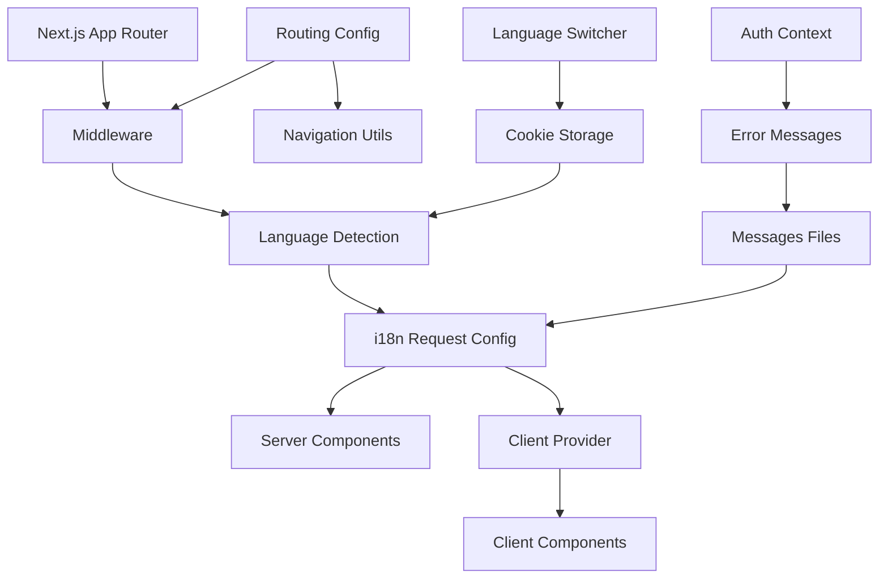

# Design Document

## Overview

国际化功能将为 Mango 应用程序提供完整的多语言支持，主要支持中文简体和英文两种语言。该设计基于 next-intl 库，利用 Next.js App Router 架构，提供静态优化的国际化解决方案。设计遵循模块化原则，确保易于维护、扩展和测试，同时保持高性能和良好的用户体验。

## Steering Document Alignment

### Technical Standards (tech.md)
该设计遵循现有技术栈的最佳实践：
- 使用 TypeScript 确保类型安全
- 遵循 Next.js 15+ App Router 架构模式
- 利用现有的 Tailwind CSS 样式系统
- 集成现有的 Supabase 认证系统
- 保持与现有组件结构的一致性

### Project Structure (structure.md)
国际化功能将按照现有项目结构进行组织：
- 配置文件位于 `src/i18n/` 目录
- 翻译文件位于 `messages/` 根目录
- 组件遵循现有的 `src/components/` 结构
- 工具函数位于 `src/lib/` 目录
- 中间件继续使用根目录的 `middleware.ts`

## Code Reuse Analysis

### Existing Components to Leverage
- **AuthContext**: 扩展以支持多语言错误消息，无需重构核心认证逻辑
- **Navbar**: 添加语言切换器组件，保持现有的用户认证状态显示
- **Button/Input/Label UI Components**: 重用现有 UI 组件，仅添加国际化支持
- **Form Components**: 利用现有的表单组件架构，添加本地化的标签和验证消息

### Integration Points
- **Supabase Auth**: 扩展现有认证流程的错误处理以支持多语言消息
- **Next.js Middleware**: 扩展现有中间件以包含语言路由处理
- **Layout System**: 集成到现有的根布局和页面布局中
- **Tailwind CSS**: 利用现有样式系统，可能需要添加 RTL 支持的类

## Architecture

系统采用基于 next-intl 的分层架构设计，将国际化功能模块化分离：

### Modular Design Principles
- **Single File Responsibility**:
  - `i18n/request.ts` 仅处理服务器端 i18n 配置
  - `i18n/routing.ts` 仅定义路由规则
  - 每个翻译文件对应一种语言
- **Component Isolation**:
  - 语言切换器为独立组件
  - 翻译 Hook 为可重用工具
  - 错误边界组件独立处理 i18n 错误
- **Service Layer Separation**:
  - 客户端和服务器端 i18n 配置分离
  - 翻译加载逻辑与 UI 逻辑分离
  - 语言检测与存储逻辑分离
- **Utility Modularity**:
  - 语言工具函数模块化
  - 翻译键验证独立工具
  - 语言格式化函数独立模块



## Components and Interfaces

### Component 1: i18n Configuration
- **Purpose:** 提供服务器端和客户端的 i18n 配置
- **Interfaces:**
  - `getRequestConfig()` - 服务器端配置
  - `NextIntlClientProvider` - 客户端配置包装器
- **Dependencies:** next-intl/server, 翻译文件
- **Reuses:** 现有的 cookie 处理逻辑

### Component 2: Language Switcher
- **Purpose:** 提供用户界面的语言切换功能
- **Interfaces:**
  - `LanguageSwitcher` React 组件
  - `changeLanguage(locale: string)` 函数
- **Dependencies:** next/navigation, js-cookie
- **Reuses:** 现有的 Button UI 组件和 Navbar 结构

### Component 3: Routing Middleware
- **Purpose:** 处理基于语言的路由和重定向
- **Interfaces:**
  - `createMiddleware(routing)` 中间件函数
  - `routing` 配置对象
- **Dependencies:** next-intl/middleware
- **Reuses:** 现有的 middleware.ts 结构

### Component 4: Translation Hooks and Utils
- **Purpose:** 提供翻译功能的 React Hooks 和工具函数
- **Interfaces:**
  - `useTranslations(namespace)` Hook
  - `t(key, params)` 翻译函数
  - `getLocale()` 当前语言获取
- **Dependencies:** next-intl, React Context
- **Reuses:** 现有的 Hook 模式和 utils 结构

### Component 5: Localized Auth Components
- **Purpose:** 为认证流程提供本地化的错误和消息处理
- **Interfaces:**
  - 扩展现有的 AuthContext 接口
  - 本地化的错误消息映射
- **Dependencies:** 现有 AuthContext
- **Reuses:** 完全重用现有认证组件，仅添加翻译层

## Data Models

### Locale Configuration Model
```typescript
interface LocaleConfig {
  locale: string;           // 'zh' | 'en'
  label: string;            // '中文' | 'English'
  flag: string;             // '🇨🇳' | '🇺🇸'
  direction: 'ltr' | 'rtl'; // 文本方向
}
```

### Translation Message Model
```typescript
interface TranslationMessages {
  auth: {
    login: string;
    register: string;
    logout: string;
    email: string;
    password: string;
    errors: Record<string, string>;
  };
  navigation: {
    dashboard: string;
    profile: string;
    welcome: string;
  };
  common: {
    submit: string;
    cancel: string;
    loading: string;
    success: string;
    error: string;
  };
}
```

### Routing Configuration Model
```typescript
interface RoutingConfig {
  locales: readonly string[];    // ['zh', 'en']
  defaultLocale: string;         // 'en'
  localePrefix: 'as-needed';     // URL 路径策略
}
```

## Error Handling

### Error Scenarios

1. **翻译文件加载失败**
   - **Handling:** 回退到默认语言（英文），显示错误边界组件
   - **User Impact:** 用户看到英文界面并有错误提示，功能不中断

2. **翻译键缺失**
   - **Handling:** 显示翻译键本身或默认文本，开发环境下在控制台警告
   - **User Impact:** 看到英文键名或占位文本，不影响功能使用

3. **语言切换失败**
   - **Handling:** 保持当前语言，显示错误 toast，记录错误日志
   - **User Impact:** 语言不会改变，用户收到简单的错误反馈

4. **不支持的语言路径**
   - **Handling:** 中间件重定向到默认语言版本
   - **User Impact:** 自动重定向到支持的语言页面

5. **服务器端渲染失败**
   - **Handling:** 降级到客户端渲染，保持基本功能
   - **User Impact:** 页面加载可能稍慢，但所有功能正常

## Testing Strategy

### Unit Testing
- 翻译 Hook 的功能测试
- 语言切换器组件的交互测试
- 语言工具函数的逻辑测试
- 错误处理场景的单元测试
- 翻译文件完整性验证测试

### Integration Testing
- 路由中间件与语言检测的集成测试
- 认证流程与多语言错误消息的集成测试
- 客户端和服务器端组件的 i18n 集成测试
- Cookie 存储与语言切换的集成测试
- Next.js 构建过程中的 i18n 配置测试

### End-to-End Testing
- 完整的语言切换用户流程测试
- 多语言认证流程的端到端测试
- SEO 和本地化 URL 的测试
- 不同浏览器语言设置的测试
- 性能测试：翻译文件加载和缓存效果