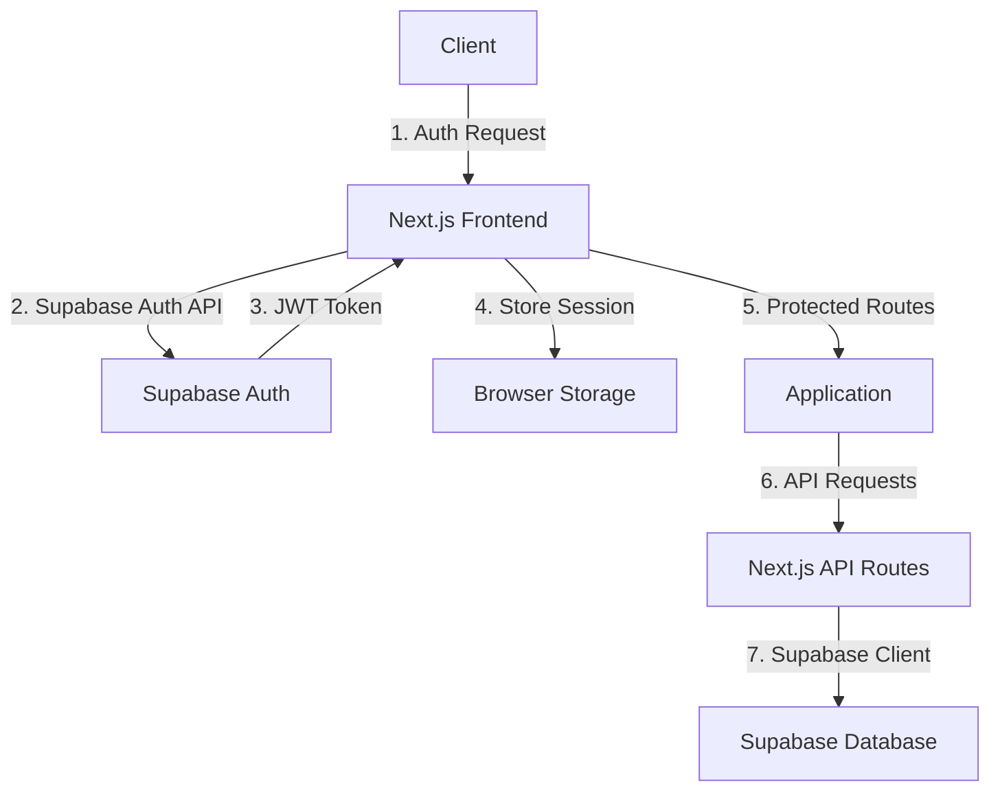
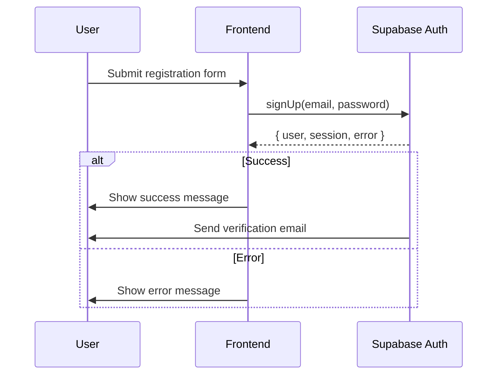
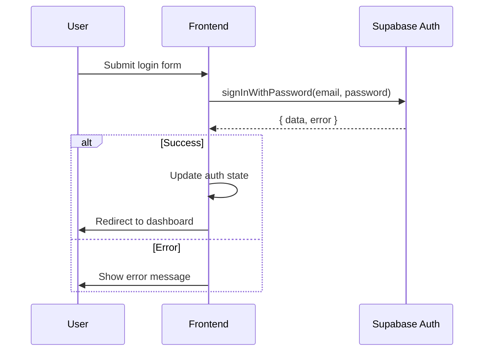
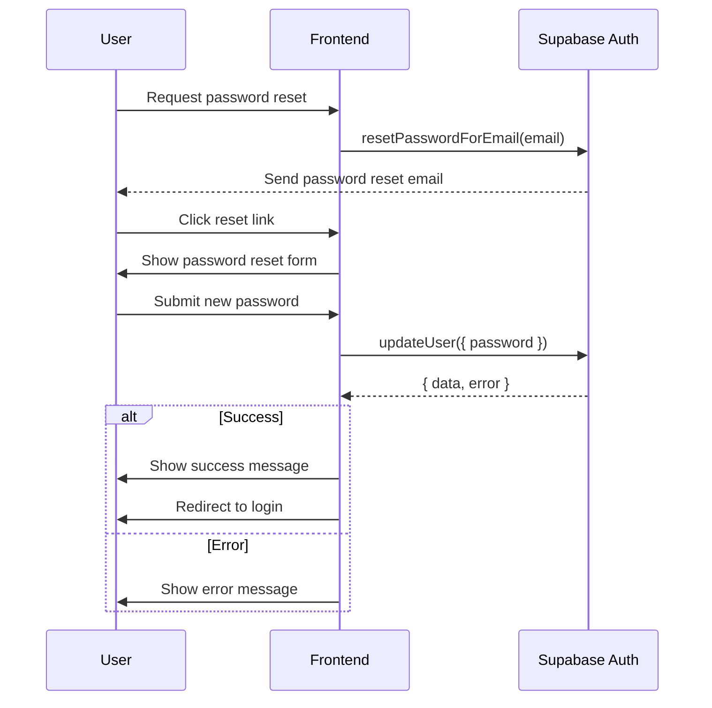

# Authentication System - Technical Design

## Overview

This document outlines the technical design for implementing a secure authentication system using Supabase as the backend service. The system will provide user registration, login, password reset, and profile management functionality, leveraging Supabase's built-in authentication features.

## Technical Standards

### Frontend
- **Framework**: Next.js 14 with TypeScript
- **State Management**: React Context for auth state
- **UI Components**: Tailwind CSS for styling
- **Form Handling**: React Hook Form with Zod validation

### Backend
- **Authentication**: Supabase Auth
- **Database**: Supabase PostgreSQL
- **Session Management**: JWT with Supabase's session handling
- **API Routes**: Next.js API routes for server-side operations

## Architecture

### High-Level Architecture



### Component Structure

```
src/
├── app/
│   ├── (auth)/
│   │   ├── login/
│   │   │   └── page.tsx
│   │   ├── register/
│   │   │   └── page.tsx
│   │   └── forgot-password/
│   │       └── page.tsx
│   ├── dashboard/
│   │   └── page.tsx
│   └── layout.tsx
├── components/
│   ├── auth/
│   │   ├── LoginForm.tsx
│   │   ├── RegisterForm.tsx
│   │   ├── ForgotPasswordForm.tsx
│   │   └── AuthProvider.tsx
│   └── ui/
│       └── Button.tsx
└── lib/
    └── supabase/
        ├── client.ts
        └── server.ts
```

## Data Models

### User Profile
```typescript
interface UserProfile {
  id: string; // UUID from auth.users
  email: string;
  email_verified: boolean;
  created_at: string;
  updated_at: string;
  // Additional profile data can be stored in a separate profiles table
}
```

### Session
```typescript
interface AuthSession {
  user: {
    id: string;
    email: string;
    // Other user properties from Supabase
  };
  expires: string;
  // Other session properties
}
```

## Authentication Flows

### 1. User Registration


### 2. User Login


### 3. Password Reset


## Security Considerations

1. **Password Security**
   - Use Supabase's built-in password hashing (bcrypt)
   - Enforce strong password policies
   - Implement rate limiting on authentication endpoints

2. **Session Security**
   - Use HttpOnly, Secure, and SameSite cookie attributes
   - Implement short-lived access tokens with refresh tokens
   - Invalidate sessions on password change

3. **Email Security**
   - Use secure transport (TLS) for all email communications
   - Implement email verification for new accounts
   - Use one-time tokens for password resets

## Error Handling

### Common Error Scenarios
1. **Invalid Credentials**
   - **Handling**: Show generic error message
   - **User Impact**: "Invalid email or password"

2. **Email Already in Use**
   - **Handling**: Show error message suggesting password reset
   - **User Impact**: "An account with this email already exists. Try signing in or resetting your password."

3. **Weak Password**
   - **Handling**: Show specific password requirements
   - **User Impact**: "Password must be at least 8 characters and include a number and special character"

## Testing Strategy

### Unit Testing
- Test form validations
- Test auth state management
- Test utility functions

### Integration Testing
- Test authentication flows
- Test protected routes
- Test error scenarios

### End-to-End Testing
- Test complete user journeys
- Test edge cases
- Test with different user roles (if applicable)

## Performance Considerations

1. **Client-Side**
   - Implement code splitting for auth-related components
   - Use React.memo for performance optimization
   - Implement loading states for better UX

2. **Server-Side**
   - Use Supabase's connection pooling
   - Implement caching where appropriate
   - Monitor and optimize database queries

## Deployment Considerations

1. **Environment Variables**
   - Store Supabase URL and anon key in environment variables
   - Use different environments for development, staging, and production

2. **CORS**
   - Configure allowed origins in Supabase dashboard
   - Restrict API access to trusted domains

3. **Monitoring**
   - Set up error tracking
   - Monitor authentication failures
   - Log security-related events

## Future Enhancements

1. **Social Login**
   - Add support for Google, GitHub, etc.
   - Implement account linking

2. **Multi-Factor Authentication**
   - Add TOTP support
   - Implement backup codes

3. **Account Recovery**
   - Add security questions
   - Implement backup email/phone verification

## Dependencies

- @supabase/supabase-js: ^2.39.0
- @supabase/ssr: ^0.1.0
- next: ^14.0.0
- react: ^18.2.0
- react-hook-form: ^7.0.0
- zod: ^3.0.0
- @hookform/resolvers: ^3.0.0
